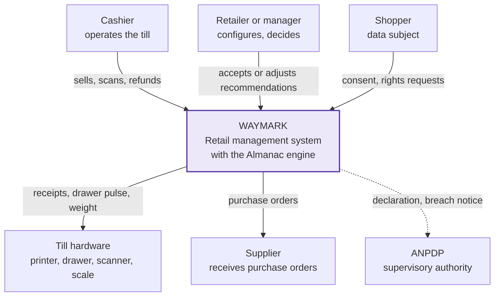

# 1 — System context

Waymark as one box. No internals. This is the diagram for a slide.

**Note.** The shopper is a data subject, not a user. They never touch the software; the
retailer is the controller and captures consent on their behalf.
