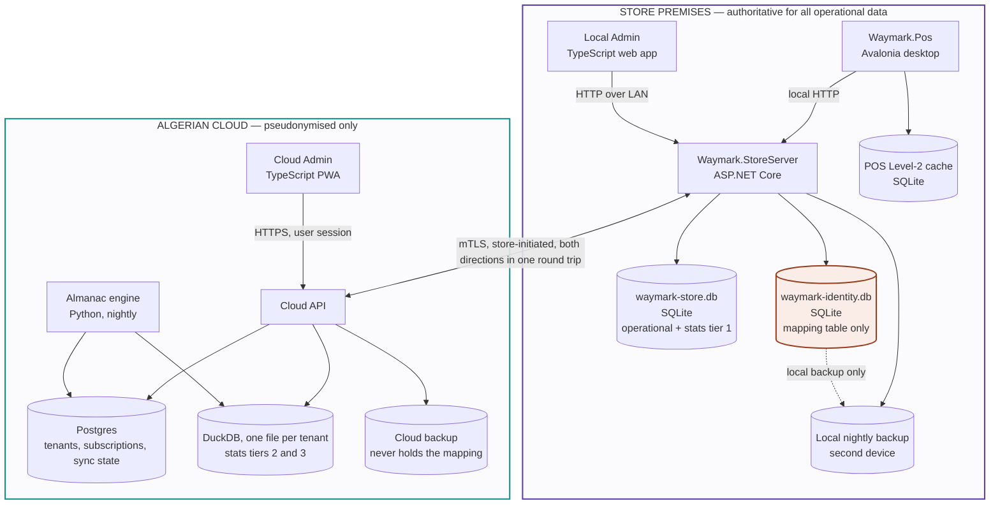

# 2 — Containers

The deployable pieces and the store/cloud line. The most useful single diagram in the
project.

**Reading it.** Only one arrow crosses between the two boxes, and it is store-initiated.
The identity database is highlighted because it is the only store that must never
cross — not over sync, not over backup.

**Absent from the cloud by design:** any screen or table showing a customer name, phone or
email.
