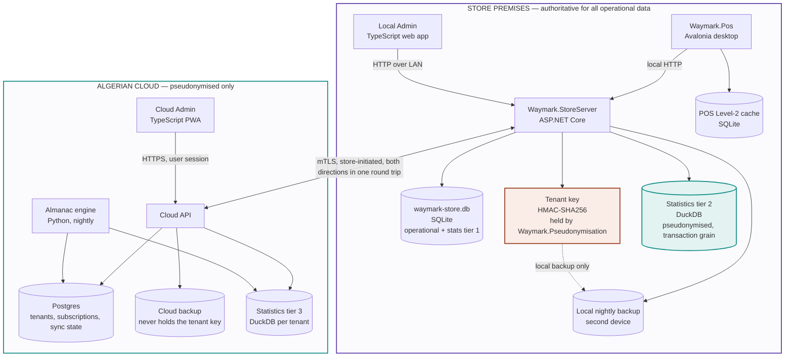

# 2 — Containers

The deployable pieces and the store/cloud line. The most useful single diagram in the
project.

**Reading it.** Only one arrow crosses between the two boxes, and it is store-initiated.
The tenant key is highlighted because it is the one thing that must never cross — not over
sync, not over backup. *(Was `waymark-identity.db`; removed by decisions.md D-039. The
pseudonym is now a keyed hash, so what is kept separately is the key rather than a mapping
table — and the exclusion is enforced by a test rather than by the file simply not being
in the backup set.)*

**Absent from the cloud by design:** any screen or table showing a customer name, phone or
email.
