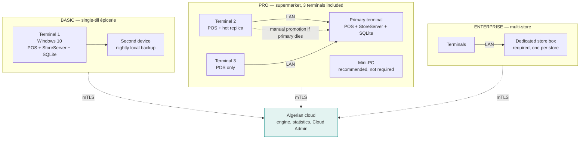

# 3 — Deployment, by tier

What physically runs on what hardware. Tier definitions from Operating Rules §2.

**Why Basic requires no extra hardware:** demanding a mini-PC from an épicerie would kill
adoption. The hot replica at Pro removes the single point of failure — a cashier shutting
down the primary — without imposing cost on anyone who cannot carry it.

**Promotion is manual, never automatic.** Automatic failover across a partitioned LAN
produces split-brain, the only genuine data-loss scenario in the design. See
Waymark_Sync_Design §11.3.
