# 4 — Personal data flow and the pseudonymisation boundary

The diagram for the DPIA: where personal data moves and, more importantly, where it stops.

```mermaid
flowchart LR
    subgraph local["ON THE PREMISES"]
        direction TB
        capture["Capture at POS or Admin<br/>name, phone, email, consent"]
        tier1[("Statistics tier 1<br/>waymark-store.db, identified")]
        key["Tenant key<br/>held only by<br/>Waymark.Pseudonymisation"]
        pseudo["Pseudonymisation<br/>THE BOUNDARY"]
        tier2[("Statistics tier 2<br/>local DuckDB<br/>pseudonymised, transaction grain")]
        outbox[("Outbox<br/>anonymous basket record<br/>monthly customer record")]
        inbox[("Inbox<br/>pseudonym-keyed")]
        integ["Integration Layer, store half<br/>resolves identity<br/>checks objection_flag<br/>writes processing_log"]
        surface["POS and Local Admin<br/>real customer shown"]
    end

    subgraph cloudside["ALGERIAN CLOUD"]
        direction TB
        tier3[("Statistics tier 3<br/>DuckDB per tenant")]
        almanac["Almanac engine<br/>sees pseudonyms only"]
        recs["Recommendations<br/>keyed by pseudonym"]
    end

    capture --> tier1
    tier1 --> pseudo
    key -.->|"never leaves the premises"| pseudo
    pseudo --> tier2
    tier2 -->|"shaped at emit: hour bands, spend bands"| outbox
    outbox ==>|"crosses the boundary"| tier3
    tier3 --> almanac
    almanac --> recs
    recs ==>|"crosses the boundary"| inbox
    inbox --> integ
    key -.->|"never leaves the premises"| integ
    integ --> surface

    style local fill:#FAECE7,stroke:#993C1D,stroke-width:2px
    style cloudside fill:#E3F3F1,stroke:#0E8C86,stroke-width:2px
    style pseudo fill:#EDE7FA,stroke:#5A3AA8,stroke-width:2px
    style key fill:#FFEEED,stroke:#93292F,stroke-width:2px
```

**The claim.** Nothing carrying a direct identifier crosses either thick arrow. The
pseudonym is a keyed hash with no mapping table (D-039), and the key is in no cloud backup
and no sync payload (D-042). Tier 2 stays local; only two deliberately mismatched streams
leave: an anonymous basket record and a monthly per-pseudonym record (D-043).

**Product improvement data** (DPIA §2.7) is not shown because it is not personal data:
aggregates over at least 20 subjects, computed at the store, from a fixed metric list.

**On erasure**, the pseudonym is nulled on the cloud's transaction rows and recorded in
the erasure ledger. The processing log needs nothing, because it never held an identifier
(D-045). See `../sync-design.md` §9.
