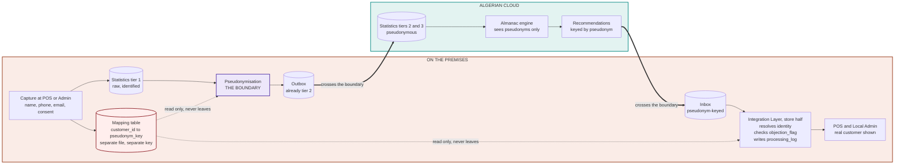

# 4 — Personal data flow and the pseudonymisation boundary

The diagram for the DPIA. Shows where personal data moves and, more importantly, where it
stops.

**The claim this diagram supports.** Nothing carrying a direct identifier crosses either
thick arrow. The mapping table is read at two points, both on the premises, and travels
nowhere.

**Product improvement data (DPIA §2.7)** is not shown because it is not personal data:
aggregates over at least 20 data subjects, computed at the store, fixed metric list.

**On erasure**, the mapping row is deleted and the pseudonym is nulled on the cloud's
transaction rows — unlinking rather than key destruction. See Waymark_Sync_Design §9.
