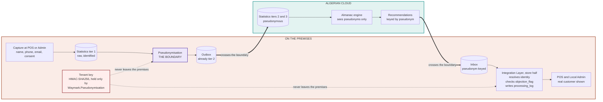

# 4 — Personal data flow and the pseudonymisation boundary

The diagram for the DPIA. Shows where personal data moves and, more importantly, where it
stops.

**The claim this diagram supports.** Nothing carrying a direct identifier crosses either
thick arrow. The pseudonym is `HMAC-SHA256(tenant_key, "waymark:customer:v1:" ‖
customer_id)` truncated to 128 bits (decisions.md D-039), and the key is used at two
points, both on the premises. It is never in a backup and never in a sync payload, which
is what stops anyone holding the cloud data from recomputing who is who.

*Revised 11/09/2026: was a mapping table in a separate file. There is no mapping and no
second database. What is kept separately is the key.*

**Product improvement data (DPIA §2.7)** is not shown because it is not personal data:
aggregates over at least 20 data subjects, computed at the store, fixed metric list.

**On erasure**, the pseudonym is nulled on the cloud's transaction rows and identity
columns in `processing_log` are purged — unlinking rather than key destruction, because
destroying a mapping alone would leave the history linked to itself and still able to
single someone out. See `Waymark_Implementation` §9.9.
