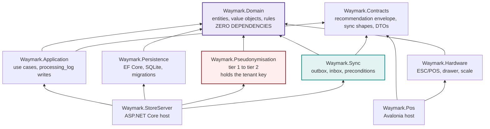

# 5 — Solution dependencies

The nine .NET projects and their permitted references. This diagram *is* the layering
rule: a project's reference list is compiler-enforced architecture.

Arrow means "references".

## The invariants this enforces

| Rule | Enforced by |
| :---- | :---- |
| No SQL inside business logic | `Domain` does not reference `Persistence` |
| **`Sync` cannot reach the key** | `Sync` references neither `Pseudonymisation` nor `Waymark.Domain.Privacy` (D-051) — the absence of that edge is the whole point |
| Auditing cannot be forgotten per call site | `processing_log` writes live in `Application` |
| Development runs with no hardware plugged in | `Hardware` is behind interfaces declared in `Domain` |
| The POS never touches the database directly | `Waymark.Pos` talks HTTP to `StoreServer`, even at Basic tier. *Not yet asserted by a test* |

**Tests:** `Waymark.Domain.Tests`, `Waymark.Application.Tests`, `Waymark.Hardware.Tests`,
`Waymark.Integration.Tests` (which holds the architecture rules, D-005).

**Outside the solution:** `waymark-admin` (TypeScript), `waymark-engine` (Python),
`waymark-cloud` (language deferred to Phase 4).

**Recorded risk.** Nine projects is a lot for one person. The three that unambiguously
earn their separation are `Domain`, `Pseudonymisation` and `Hardware`. If time pressure
bites, others may be merged and re-split later.
