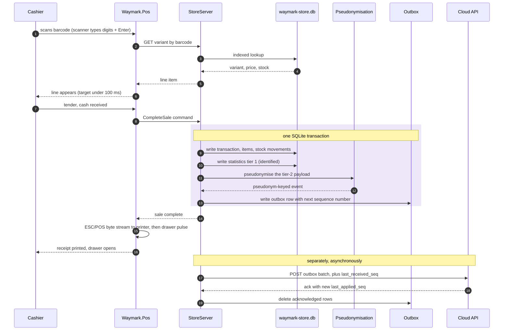

# 6 — Completing a sale

The walking skeleton's spine. Note that the transaction rows and the outbox row are
written in one database transaction — both or neither.

**Why the ack matters.** Outbox rows are deleted only after acknowledgement. A lost ack
costs a harmless replay; deleting early costs data.

**Offline changes nothing above the dividing note.** The outbox simply grows. Same code
path.
