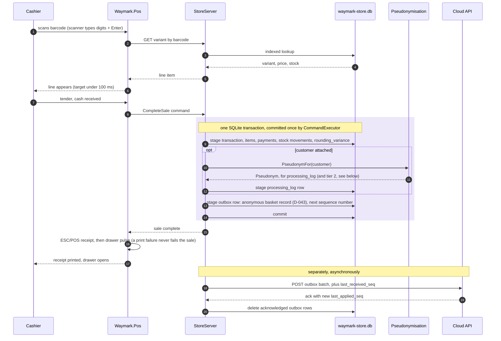

# 6 — Completing a sale

The walking skeleton's spine. The domain rows and the outbox row are written in one
database transaction, both or neither, and the executor is the only thing that commits
(D-050).

**Why the ack matters.** Outbox rows are deleted only after acknowledgement. A lost ack
costs a harmless replay; deleting early costs data.

**Offline changes nothing above the dividing note.** The outbox simply grows.

**Open for Phase 0.5.** Tier 2 lives in DuckDB (D-043), which cannot join this SQLite
transaction, so when and how it is fed from tier 1 is still to decide (`../status.md`
§6). The monthly customer record is emitted by a periodic job, not by the sale.
