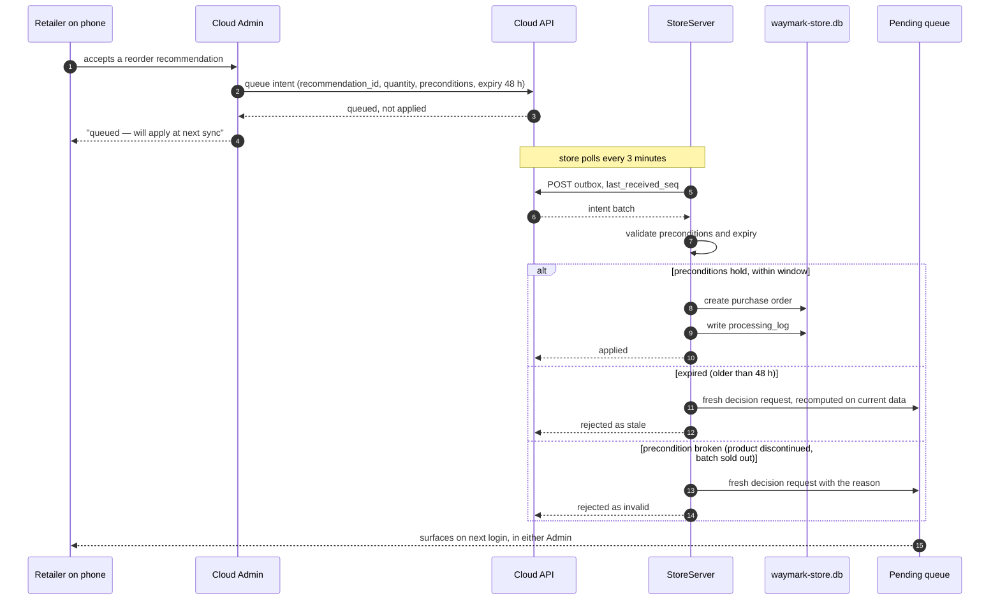

# 7 — A Cloud Admin decision reaching the store

The only channel with real difficulty. Both the success and the rejection paths are shown,
because silent rejection is the failure that destroys trust in sync.

**Why re-confirmation was rejected.** If the store is offline, the Cloud Admin the
retailer is looking at is already stale. Asking them to re-confirm gives them a second chance
to decide on the same stale picture. Fixed expiry windows per intent type instead — see
`../sync-design.md` §6.3.

**Idempotency.** If the same recommendation is decided both in Cloud Admin and at the
store, `recommendation_id` is the key: first decision wins, second is a no-op with a
notice.
