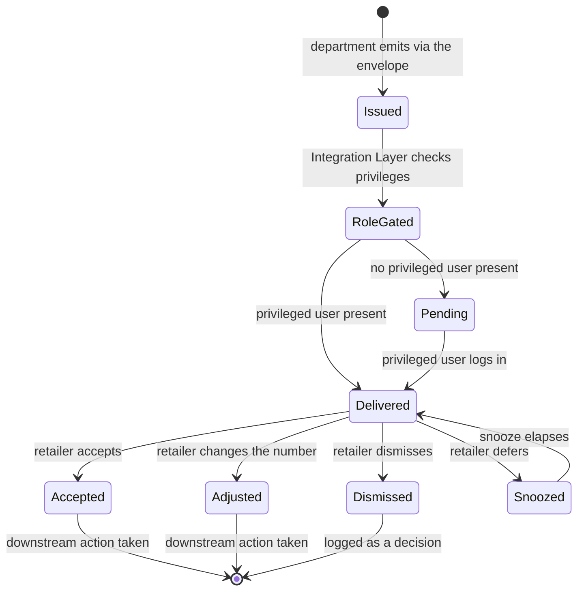
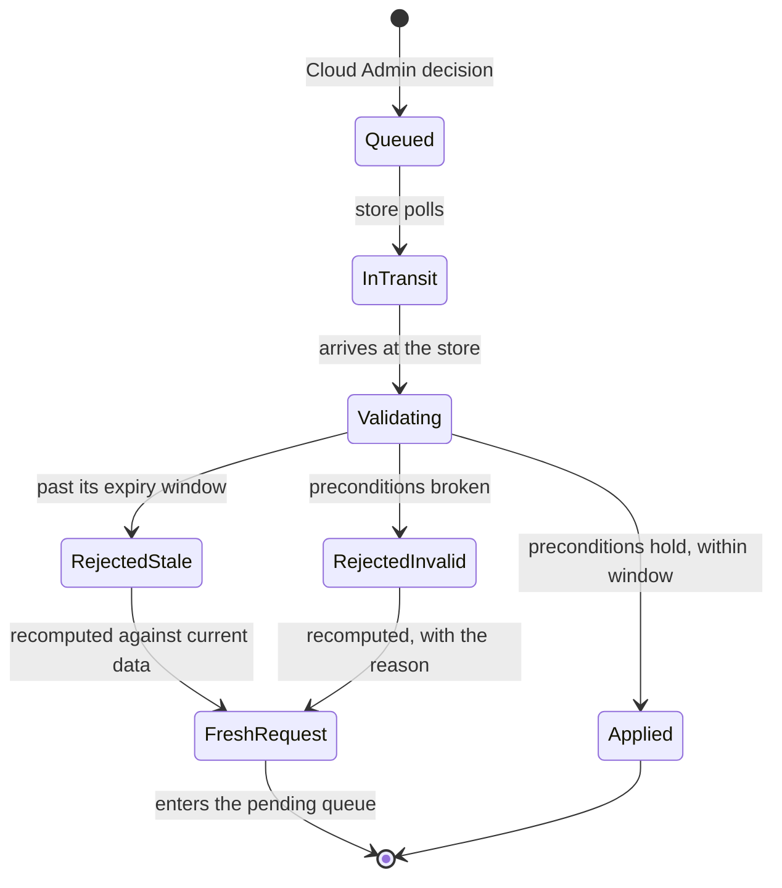

# 8 — Recommendation and intent lifecycles

Two state machines. The Integration Layer implements both.

## Recommendation

Every terminal transition writes to the statistics module, because the decision itself is
a signal — revealed preference feeds parameter tuning later.

`action_type` is `binary` (accept or decline) or `menu` (pick one of several), per
System_Architecture. Group 3's markdown ladder needs `menu`.

## Intent

**No silent terminal state on the rejection paths.** Both rejections become a fresh
decision request the retailer sees. Expiry windows per intent type are tabulated in
Waymark_Sync_Design §6.3.
